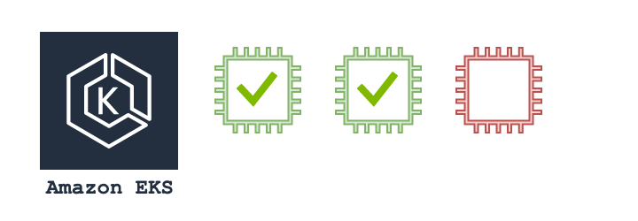

<p align="center">
  
</p>

# EKS Rolling Update

[](https://travis-ci.org/hellofresh/eks-rolling-update)

> EKS Rolling Update is a utility for updating the launch configuration of worker nodes in an EKS cluster.


- [Intro](#intro)
- [Requirements](#requirements)
- [Installation](#installation)
- [Usage](#usage)
- [Configuration](#configuration)
- [Contributing](#contributing)
- [License](#license)


<a name="intro"></a>
# Intro

EKS Rolling Update is a utility for updating the launch configuration of worker nodes in an EKS cluster. It
updates worker nodes in a rolling fashion and performs health checks of your EKS cluster to ensure no disruption to service.
To achieve this, it performs the following actions:

* Pauses Kubernetes Autoscaler (Optional)
* Finds a list of worker nodes per ASG that do not have a launch config that matches the ASG
* Scales up the desired capacity on the ASG
* Ensures the ASG are healthy and that the new nodes have joined the EKS cluster
* Suspends AWS Autoscaling actions while update is in progress
* Drains outdated EKS outdated worker nodes one by one
* Terminates EC2 instances of the worker nodes one by one
* Detaches EC2 instances from the ASG one by one
* Resumes AWS Autoscaling actions
* Resumes Kubernetes Autoscaler (Optional)

<a name="requirements"></a>
## Requirements

* [kubectl](https://kubernetes.io/docs/tasks/tools/install-kubectl/) installed
* `KUBECONFIG` environment variable set
* AWS credentials [configured](https://boto3.amazonaws.com/v1/documentation/api/latest/guide/configuration.html#guide-configuration)

EKS Rolling Update expects that you have valid `KUBECONFIG` and AWS credentials set prior to running.

<a name="installation"></a>
## Installation

Install

```
virtualenv -p python3 venv
source venv/bin/activate
pip3 install -r requirements.txt
```

Set KUBECONFIG and context

```
export KUBECONFIG=~/.kube/config
ktx <environment>
```

<a name="usage"></a>
## Usage

```
usage: eks_rolling_update.py [-h] --cluster_name CLUSTER_NAME [--plan [PLAN]]

Rolling update on cluster

optional arguments:
  -h, --help            show this help message and exit
  --cluster_name CLUSTER_NAME, -c CLUSTER_NAME
                        the cluster name to perform rolling update on
  --plan [PLAN], -p [PLAN]
                        perform a dry run to see which instances are out of
                        date
```

Example:

```
eks-rolling-update.py -c my-eks-cluster
```

## Configuration

| Parameter                 | Description                                                                                                        | Default                              |
|---------------------------|--------------------------------------------------------------------------------------------------------------------|--------------------------------------|
| K8S_AUTOSCALER_ENABLED    | If True Kubernetes Autoscaler will be paused before running update                                                 | True                                 |
| K8S_AUTOSCALER_NAMESPACE  | Namespace where Kubernetes Autoscaler is deployed                                                                  | ""                                   |
| K8S_AUTOSCALER_DEPLOYMENT | Deployment name of Kubernetes Autoscaler                                                                           | ""                                   |
| ASG_DESIRED_STATE_TAG     | Temporary tag which will be saved to the ASG to store the state of the EKS cluster prior to update                 | eks-rolling-update:desired_capacity  |
| ASG_ORIG_CAPACITY_TAG     | Temporary tag which will be saved to the ASG to store the state of the EKS cluster prior to update                 | eks-rolling-update:original_capacity |
| CLUSTER_HEALTH_WAIT       | Number of seconds to wait after ASG has been scaled up before checking health of the cluster                       | 90                                   |
| GLOBAL_MAX_RETRY          | Number of attempts of a health check                                                                               | 12                                   |
| GLOBAL_HEALTH_WAIT        | Number of seconds to wait before retrying a health check                                                           | 20                                   |
| DRY_RUN                   | If True, only a query will be run to determine which worker nodes are outdated without running an update operation | False                                |

<a name="contributing"></a>
## Contributing

Please read [CONTRIBUTING.md](CONTRIBUTING.md) for details on our code of conduct, and the process for submitting pull requests to us.

<a name="licence"></a>
## License

This project is licensed under the Apache 2.0 License - see the [LICENSE](LICENSE) file for details